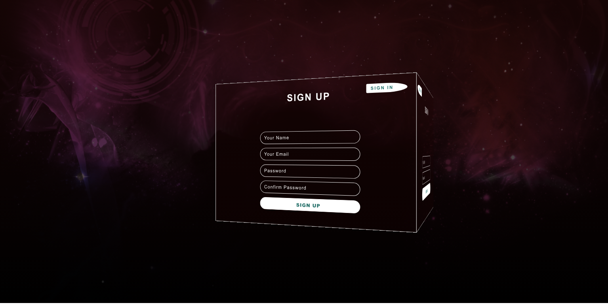
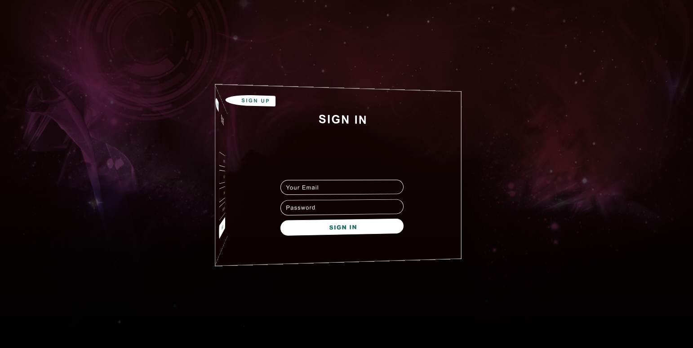

# 3D-login-page

<a name="readme-top"></a>

  <div align="center">
    <p>
    A 3D login page is an immersive and visually engaging web interface that incorporates three-dimensional design elements to enhance user interaction and create a unique login experience.<br/>
      <br/>
      Built by: @kzm
      <br/>
     </p>
  </div>
   <!-- TABLE OF CONTENTS -->
      <details>
    <summary>Table of Contents</summary>
      <ul>
          <li> <a href="#about-the-project">About The Project</a></li>
          <li><a href="#photos">Photos</a></li>
          <li><a href="#built-with">Built With</a></li>
          <li><a href="#description">Description</a></li>
          <li><a href="#getting-started">Getting Started</a></li>
          <li><a href="#installation">Installation</a></li>
          <li><a href="#Support">Support</a></li>
      </ul>
  </details>
  <!-- ABOUT THE PROJECT -->

## About The Project

### Photos





  <p align="right"><a href="#readme-top">back to top</a></p>
  
### Built With
  


  <p align="right"><a href="#readme-top">back to top</a></p>
  
 ### Description
Thank you for your understanding and viewing this simple animation project.
If you like what you see, I'd be truly grateful if you consider giving it a star 🌟
 Your appreciation means a lot!🌟
<h3>TL;DR</h3>
Feel free to fork this repo for your own purposes.

  <p align="right"><a href="#readme-top">back to top</a></p>

<!-- GETTING STARTED -->

## Getting Started

To get a local copy up and running follow these simple example steps.

### Installation

1. Clone the repo
   ```sh
   git clone https://github.com/kzmfhm/3D-login-page.git
   ```
2. Copy path of index.html and open browser to view Project.Then vew 3D-Animation!

<p align="right"><a href="#readme-top">back to top</a></p>

### ⭐️Support

Give a ⭐️ if this project helped you!

<p align="right"><a href="#readme-top">back to top</a></p>
